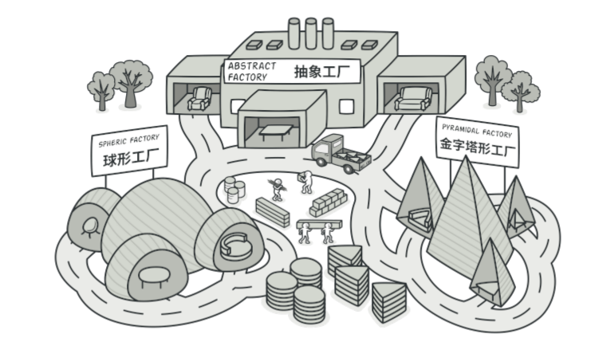
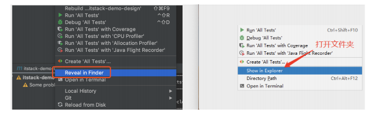

# 抽象工厂模式介绍

抽象⼯⼚模式与⼯⼚⽅法模式虽然主要意图都是为了解决，接⼝选择问题。但在实现上，抽象⼯⼚是⼀

个中⼼⼯⼚，创建其他⼯⼚的模式。

可能在平常的业务开发中很少关注这样的设计模式或者类似的代码结构，但是这种场景确⼀直在我们身

边，例如；

1. 不同系统内的回⻋换⾏
2. Unix系统⾥，每⾏结尾只有 <换⾏>，即 \n ；
3. Windows系统⾥⾯，每⾏结尾是 <换⾏><回⻋>，即 \n\r ；
4. Mac系统⾥，每⾏结尾是 <回⻋>
5. IDEA 开发⼯具的差异展示(Win\Ma

除了这样显⽽易⻅的例⼦外，我们的业务开发中时常也会遇到类似的问题，需要兼容做处理。但⼤部分

经验不⾜的开发⼈员，常常直接通过添加 ifelse ⽅式进⾏处理了。

很多时候初期业务的蛮荒发展，也会牵动着研发对系统的建设。

预估 QPS较低 、 系统压⼒较⼩ 、 并发访问不⼤ 、 近⼀年没有⼤动作 等等，在考虑时间投⼊成本的前提

前，并不会投⼊特别多的⼈⼒去构建⾮常完善的系统。就像对 Redis 的使⽤，往往可能只要是单机的就可以满⾜现状。

不吹⽜的讲百度⾸⻚我上学时候⼀天就能写完，等毕业⼯作了就算给我⼀年都完成不了！

但随着业务超过预期的快速发展，系统的负载能⼒也要随着跟上。原有的单机 Redis 已经满⾜不了系

统需求。这时候就需要更换为更为健壮的Redis集群服务，虽然需要修改但是不能影响⽬前系统的运⾏，还要平滑过渡过去。

随着这次的升级，可以预⻅的问题会有；

> 1. 很多服务⽤到了Redis需要⼀起升级到集群。
> 2. 需要兼容集群A和集群B，便于后续的灾备。
> 3. 两套集群提供的接⼝和⽅法各有差异，需要做适配。
> 4. 不能影响到⽬前正常运⾏的系统。
